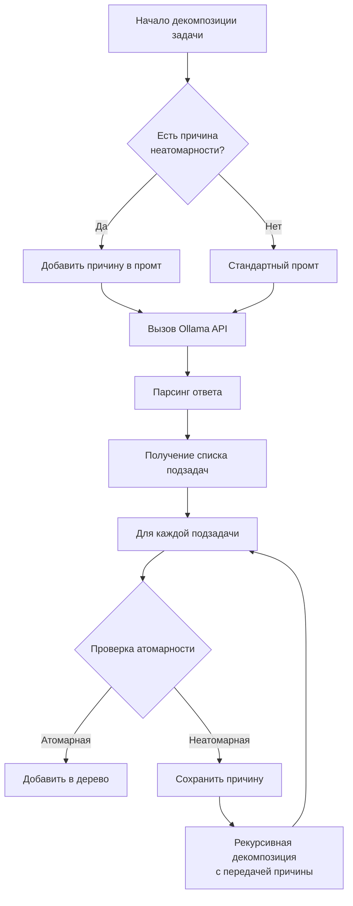
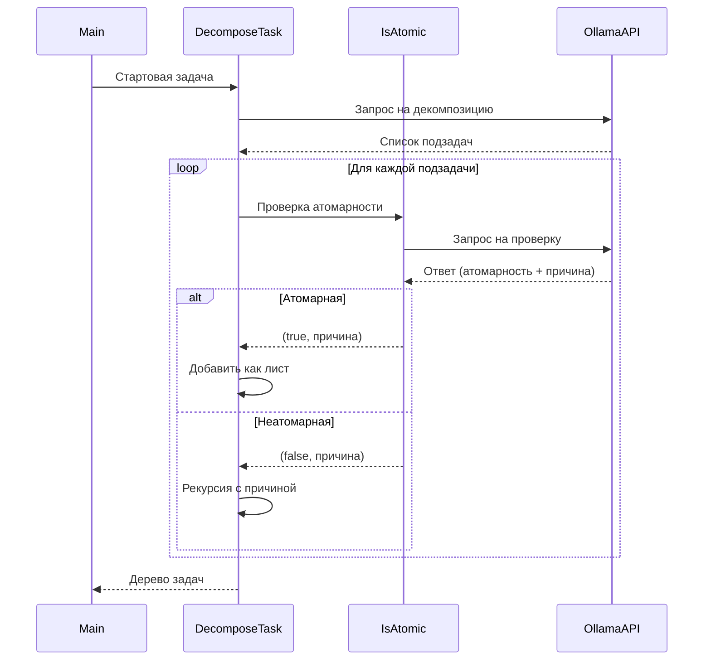

# 🧩 IntelliDecomposer

**Your AI-powered task decomposition assistant!**  
Break down complex tasks into bite-sized atomic steps using Ollama and AI magic ✨

## 🚀 What's This?

Ever felt overwhelmed by a big task? "Write a novel" or "Build a rocket engine" sounds scary 😱. IntelliDecomposer uses AI to:

1. **Chop** big tasks into smaller subtasks  
2. **Recursively decompose** until everything's atomic  
3. **Generate** a clear action plan  

Perfect for project planning, learning roadmaps, or just taming your TODO list! 📋✅

## ⚙️ Tech Stack

- 🦙 [Ollama](https://ollama.com/) (local LLM runner)
- 🤖 `deepseek-coder-v2` (coding-savvy AI model)
- 💻 .NET 7 CLI app
- 🧠 Recursive AI decomposition

## 🛠️ Installation

### Prerequisites
1. Install [Ollama](https://ollama.com/download)
2. Pull the AI model:
```bash
ollama pull deepseek-coder-v2:latest
```

### Get the App
```bash
# Clone the repo
git clone https://github.com/pwrmind/IntelliDecomposer.git
cd IntelliDecomposer

# Build it
dotnet build
```

## 🎯 Usage

```bash
dotnet run -- "Your complex task here"
```

### Example
```bash
dotnet run -- "Create a responsive website for a bakery"
```

### Sample Output
```
🎯 Главная задача: Create a responsive website for a bakery
📋 Итоговый список атомарных задач:
✅ Design homepage layout
✅ Create color scheme
✅ Implement mobile navigation
✅ Add product gallery
✅ Setup contact form
✅ Optimize images
✅ Implement SEO tags
✅ Test on Chrome
✅ Test on Safari
```

## 🔍 How It Works


---


1. **AI Prompting** 🔮  
   We send tasks to Ollama with special formatting instructions
2. **Recursive Decomposition** ♻️  
   Keeps breaking down tasks until they're atomic
3. **Smart Parsing** 🧠  
   Extracts tasks from AI responses automatically
4. **Emoji-Powered Logging** 💬  
   Because who wants boring terminals?

## 🐛 Known Quirks

- Sometimes AI gets *too* granular ("Breathe oxygen" as a subtask 😅)
- Works best with technical/project tasks
- Add `-v` later for verbose mode! (PRs welcome 👀)

## 👥 Contribute

Found a bug? Want improvements?  
1. Fork it 🍴
2. Code it 💻
3. PR it 🎁

Pro tip: Run with debugging to see AI conversations!  
```bash
dotnet run -- "Your task" > log.txt
```

## 📜 License

MIT - Go wild! 🎉  
*(Just don't make Skynet, okay?)*

---

Made with ❤️ and too much coffee ☕ by [Your Name]  
Let's build cooler stuff together! 🚀